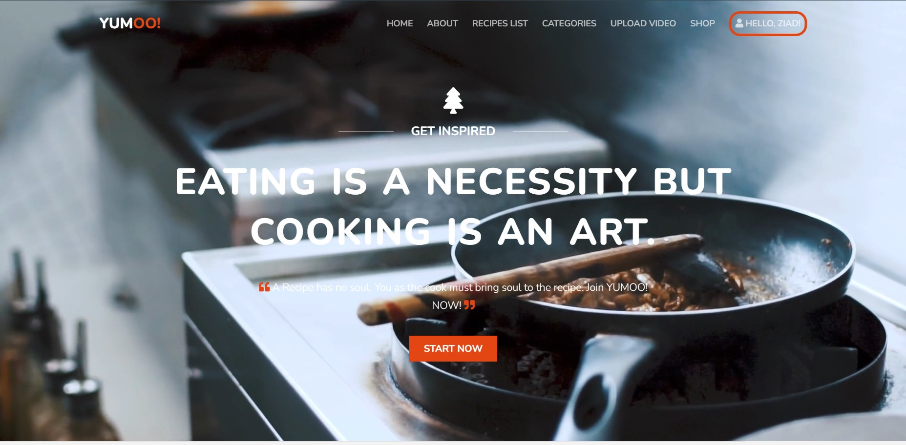
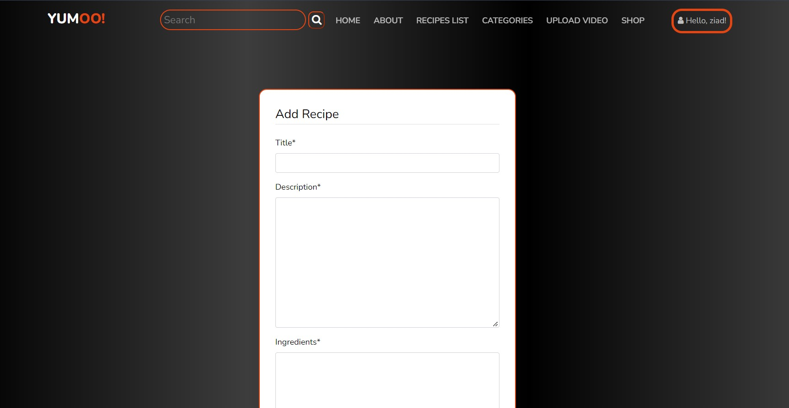
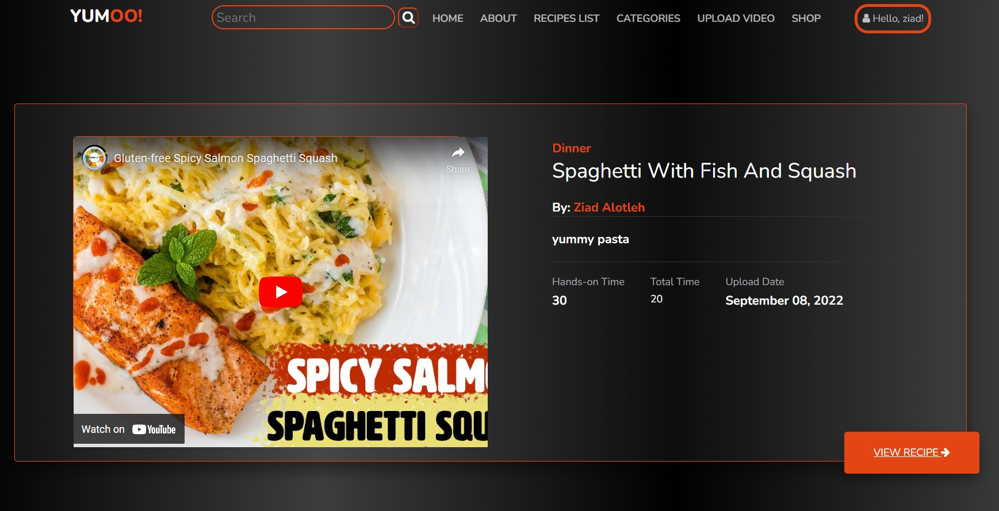

building a social platform where people are able to share their recipes and anything related to recipes in different
ways:

Have a sneak peek first:)








## Getting Started

YUMOO! stores the data in SQLite database as it is lightweight, 
small and current project scope does not require more advanced database type.
Soon it will be dockerized.

Installation and usage:

Local installation
Clone the repository and create a virtual environment for it. Currently, YUMOO! uses Python 3.10
```
python3.10 -m venv venv
```
```
source venv/bin/activate
```
Install the requirements

```
pip install -r requirements-dev.txt
```
Run the following commands for migration:
```
python manage.py makemigrations
```
then
```
python manage.py migrate
```
User needs to be logged-in in order to upload video, add comments, like.
Shop features can be used without being logged in.


Testing
Launch the tests with pytest tests


Navigate to http://127.0.0.1:5000 or http://localhost:5005

These instructions will get you a copy of the project up and running on your local machine for development and testing purposes.

## Prerequisites

What things you need to install the software and how to install them.
after cloning the project cd to recipe_platform_app then run the following command on your terminal 
```
pip install requiremnets.txt
```
## Testing

To run all the tests, please make sure if you are in the recipe_platform_app/recipe_platform_app by using:

```
cd recipe_platform_app/recipe_platform_app
```

then run:

```
python manage.py test
```
for test of specific application, for example user, you can use:
```
python manage.py test user
```